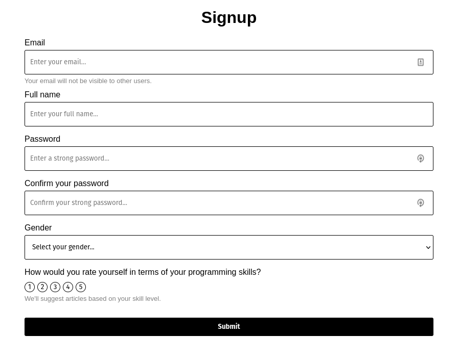
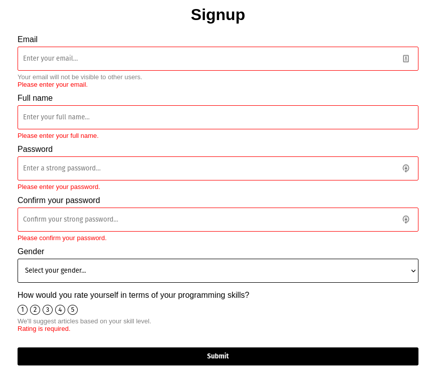

Handling input forms has historically been a pet peeve of many front-end web developers. Having to manually manage the state of the form by passing the right values and event handlers into inputs is simple enough for forms with one or two inputs, but the unscalability of the approach is promptly revealed as the form grows and turns into a large chunk of boilerplate code.

```tsx
export const SignupForm: React.FC = () => {
  const [email, setEmail] = useState<string>("");
  const [firstName, setFirstName] = useState<string>("");
  const [lastName, setLastName] = useState<string>("");
  const [password, setPassword] = useState<string>("");
  const [passwordConfirmation, setPasswordConfirmation] = useState<string>("");

  const onFormSubmit = () => {
    const values = {
      email,
      firstName,
      lastName,
      password,
      passwordConfirmation,
    };

    alert(JSON.stringify(values, null, 2));
  };

  return (
    <form onSubmit={onFormSubmit}>
      <input
        type="text"
        value={email}
        onChange={(e) => setEmail(e.target.value)}
      />
      <input
        type="text"
        value={firstName}
        onChange={(e) => setFirstName(e.target.value)}
      />
      <input
        type="text"
        value={lastName}
        onChange={(e) => setLastName(e.target.value)}
      />
      <input
        type="password"
        value={password}
        onChange={(e) => setPassword(e.target.value)}
      />
      <input
        type="password"
        value={passwordConfirmation}
        onChange={(e) => setPasswordConfirmation(e.target.value)}
      />
      <button type="submit">Submit</button>
    </form>
  );
};
```

Uh-oh! Not only is the code above very long and the patterns in it keep repeating (the `useState` hook, the set state call with `e.target.value`), but it also diverts our attention from the actual form contents. We spend more time trying to comb through the repeating patterns than what the form actually does. We spend more time on the _how_ than the _what_. This has a negative impact on readability.

Another issue is having to manually compile the submitted form values together into an object in the `onFormSubmit` function.

The code above is just the tip of the iceberg when it comes to manually handling forms - things get even more complex with error handling and custom inputs.

Wouldn't it be great if the form could look like this instead?

```tsx
export const SignupForm: React.FC = () => {
  const onFormSubmit = (values) => {
    // values is the object that corresponds to names of inputs (email, firstName, lastName, ...)
    alert(JSON.stringify(values, null, 2));
  };

  return (
    <form onSubmit={onFormSubmit}>
      <input name="email" />
      <input name="firstName" />
      <input name="lastName" />
      <input name="password" type="password" />
      <input name="passwordConfirmation" type="password" />
      <button type="submit">Submit</button>
    </form>
  );
};
```

Perfect - the code is shorter and all implementation details of the form are hidden.

The code above will not work if you try to run it, but we can still achieve this by using a form library. In this blog post, I'll be using [Formik](https://formik.org/) to replicate the code above. But we'll also be adding more complex inputs and form validation, and everything will stay type-safe with the help of Typescript!

# The goal

The form we will be building has some text inputs, a dropdown, and a custom-built rating input. I wanted to include a custom-built input to demonstrate how Formik's power is not tied just to built-in HTML inputs, but it can also be extended to handle anything you want. The form inputs will also have a label, an optional help message, and an error message.

The form we will build is a simple sign-up form for developers.





If you'd just like to see the end code, it's available on Github here: [https://github.com/leonpahole/formik-custom-fields-typescript-example](https://github.com/leonpahole/formik-custom-fields-typescript-example)

# Preparation

This blog post will not focus on the complete basics of Formik. I suggest checking out the amazing documentation of Formik for a quick overview here: [https://formik.org/docs/overview](https://formik.org/docs/overview).

In our project, we should install Formik and Yup. We will be using Yup to validate our forms.

```
yarn add formik
yarn add yup
```

# The process

I like to build forms from the bottom-up approach:

1. Create a stand-alone input component
2. Create a custom Formik field for the stand-alone input component that we built in step 1 - we will skip this step for the first iteration of the form, so we can contrast the approaches with and without Formik custom fields.
3. Add the input to the Formik form

Let's get started!

## Step 1: stand-alone input component

The stand-alone input component (referred to as the "input component" for the rest of this chapter) is a simple React component that is oblivious to Formik. It is written as a reusable component that is not dependent on any global state; it receives props and emits all state changes.

In its simplest form, we can imagine it as a text input that accepts a value and emits whenever the input value changes (`value` and `onChange` props - the same way the `input` tag behaves). It's a controlled component - it expects the parent to pass in the value once the `onChange` is fired. We can design the inputs and outputs of this component in any way we want to achieve the desired behavior.

Based on the form image above, we will have three types of inputs - a text input (for email, full name, and password), a dropdown (for gender), and a custom input for selecting the developer's skill level - we'll call this the `rating input`.

### Text input

Here's the code for the text input (I'm excluding the CSS here, as it's of lesser importance):

```tsx
// src/components/inputs/TextInput
import clsx from "clsx";
import React from "react";
import "./TextInput.css";

// default HTML props for an input
type BuiltInTextInputProps = React.DetailedHTMLProps<
  React.InputHTMLAttributes<HTMLInputElement>,
  HTMLInputElement
>;

// custom props for custom functionality of the input
interface CustomTextInputProps {
  name: string;
  label: string;
  errorText?: string;
  helpText?: string;
  onKeyDownEnter?(): void;
  onChangeText?(text: string): void;
}

export type TextInputProps = BuiltInTextInputProps & CustomTextInputProps;

export const TextInput: React.FC<TextInputProps> = (props) => {
  const {
    label,
    errorText,
    helpText,
    onKeyDownEnter,
    onChangeText,
    ...inputProps
  } = props;
  const hasError = errorText != null;

  return (
    <label
      htmlFor={inputProps.id || inputProps.name}
      className="text-input-label"
    >
      {label}
      <input
        {...inputProps}
        onKeyDown={(e) => {
          // override onKeyDown to fire the enter key down event
          if (e.key === "Enter") {
            onKeyDownEnter?.();
          }

          inputProps.onKeyDown?.(e);
        }}
        onChange={(e) => {
          // override on change to fire change text event
          inputProps.onChange?.(e);
          onChangeText?.(e.target.value);
        }}
        className={clsx(inputProps.className, "text-input", {
          error: hasError,
        })}
      />
      <div className="text-input-bottom-text-container">
        {helpText && <span className="text-input-help-text">{helpText}</span>}
        {errorText && (
          <span className="text-input-error-text">{errorText}</span>
        )}
      </div>
    </label>
  );
};
```

Let's look at each of the sections in the code above in more detail:

```tsx
// src/components/inputs/TextInput
```

I like to put input components into a dedicated folder inside the `components/input` subfolder. It's my personal preference and also prepares the structure for the formik component we'll create soon.

```tsx
import clsx from "clsx";
import React from "react";
import "./TextInput.css";
```

You'll notice no imports related to Formik. This component has no idea it will be used by Formik.

```tsx
// default HTML props for an input
type BuiltInTextInputProps = React.DetailedHTMLProps<
  React.InputHTMLAttributes<HTMLInputElement>,
  HTMLInputElement
>;

// custom props for custom functionality of the input
interface CustomTextInputProps {
  name: string;
  label: string;
  errorText?: string;
  helpText?: string;
  onKeyDownEnter?(): void;
  onChangeText?(text: string): void;
}

export type TextInputProps = BuiltInTextInputProps & CustomTextInputProps;
```

This section of code is what makes Typescript type safety work properly.

We define the type for props (`TextInputProps`) so that our component will be type-safe when used. The `TextInputProps` type is an [intersection type](https://www.typescriptlang.org/docs/handbook/unions-and-intersections.html#intersection-types) that consists of two types.

The first type is the `BuiltInTextInputProps`. This type contains all props that a standard HTML text input would accept, such as `type`, `onChange`, `value`, `placeholder`, etc. We use this type so we don't have to manually specify each built-in prop for our text input. If we ever have to remove a certain prop from this type, we can do so with the [`Omit` keyword in Typescript](https://www.typescriptlang.org/docs/handbook/utility-types.html#omittype-keys).

The second type is the `CustomTextInputProps`. This type defines custom props that are not built-in and will be used to fulfill all necessary functionality for our text input. In this case, our inputs need to support error messages and help text (displayed below the input).
You'll notice that we also specify `name` here, even though the `BuiltInTextInputProps` contains it. The reason we do that is that in `BuiltInTextInputProps` the `name` prop is optional, but we want to make it required (because it is required for Formik to work properly, so we'd rather enforce it, as it could save us time down the road). Using intersection types we can override props from one type with props from another, as long as we name them the same and we specify the overriding type after the overridden one in the intersection (notice that `CustomTextInputProps` is after `BuiltInTextInputProps` in `TextInputProps` declaration.)
Finally, we also define some utility functions: `onKeyDownEnter` that fires when enter is pressed in the input (we don't actually need this anywhere, but it's showcased here) and the `onChangeText`, which makes it easy to get the input's text without having to write `e.target.value`.

```tsx
const {
  label,
  errorText,
  helpText,
  onKeyDownEnter,
  onChangeText,
  ...inputProps
} = props;
```

We split the props between custom and built-in ones using destruction. This is useful so we don't have to manually specify each prop for the input - instead, we'll spread it into the input like this:

```tsx
<input {...inputProps} />
```

```tsx
<input
  {...inputProps}
  onKeyDown={(e) => {
    // override onKeyDown to fire the enter key down event
    if (e.key === "Enter") {
      onKeyDownEnter?.();
    }

    inputProps.onKeyDown?.(e);
  }}
  onChange={(e) => {
    // override on change to fire change text event
    inputProps.onChange?.(e);
    onChangeText?.(e.target.value);
  }}
  className={clsx(inputProps.className, "text-input", {
    error: hasError,
  })}
/>
```

Here we manually override few props on the input so that we can fire custom event handlers. You'll notice that in each event handler we still call the default handler in the end, so that the behavior of the input doesn't break. We shouldn't do this:

```tsx
<input
  {...inputProps}
  onKeyDown={(e) => {
    if (e.key === "Enter") {
      onKeyDownEnter?.();
    }
  }}
  onChange={(e) => {
    onChangeText?.(e.target.value);
  }}
  className={clsx("text-input", {
    error: hasError,
  })}
/>
```

If we do this, then `onKeyDown`, `onChange` and `className` props of the input would not do anything, which would confuse whoever were to use this component in their code. Even though we define some custom behavior on our input to make it easier to work with, we still should make sure that the input behaves as expected.

The rest of the component deals with rendering the `label`, `helpText`, and `errorText`, which should be straightforward.

### Dropdown

The dropdown is structurally very similar to the input. In fact it is so similar, that you'll notice some code repetition, which we'll deal with shortly.

```tsx
// src/components/inputs/Dropdown
import clsx from "clsx";
import React from "react";
import "./Dropdown.css";

// default HTML props for an input
type BuiltInDropdownProps = React.DetailedHTMLProps<
  React.SelectHTMLAttributes<HTMLSelectElement>,
  HTMLSelectElement
>;

export interface DropdownOption {
  title: string;
  value: string;
}

// custom props for custom functionality of the input
interface CustomDropdownProps {
  options: DropdownOption[];
  onSelectOption?(option: any): void;
  selectOptionText?: string;
  name: string;
  label: string;
  errorText?: string;
  helpText?: string;
}

export type DropdownProps = BuiltInDropdownProps & CustomDropdownProps;

export const Dropdown: React.FC<DropdownProps> = (props) => {
  const {
    label,
    errorText,
    helpText,
    options,
    onSelectOption,
    selectOptionText = "Select your option...",
    ...dropdownProps
  } = props;
  const hasError = errorText != null;

  return (
    <label
      htmlFor={dropdownProps.id || dropdownProps.name}
      className="dropdown-label"
    >
      {label}
      <select
        {...dropdownProps}
        onChange={(e) => {
          // override on change to fire on select option event
          dropdownProps.onChange?.(e);
          onSelectOption?.(e.target.value);
        }}
        className={clsx(dropdownProps.className, "dropdown", {
          error: hasError,
        })}
      >
        <option value={undefined} disabled selected>
          {selectOptionText}
        </option>
        {options.map((option) => (
          <option key={option.value} value={option.value}>
            {option.title}
          </option>
        ))}
      </select>
      <div className="dropdown-bottom-text-container">
        {helpText && <span className="dropdown-help-text">{helpText}</span>}
        {errorText && <span className="dropdown-error-text">{errorText}</span>}
      </div>
    </label>
  );
};
```

The largest difference between `Dropdown` and `TextInput` is the custom props, which specify options of the dropdown and an event handler for selecting an option. In the JSX, the options are rendered with a `map` function.

#### A bit of refactoring

Before we continue, let's deal with the code repetition issue. Three things are repeating:

- Custom props of the component all contain `helpText`, `name`, `label`, and `errorMessage` because this is the information that we want on each input.
- Each input is wrapped with a label, error message, and help text.
- The CSS is very similar between components.

We solved this by:

- Creating a new interface `SharedInputProps`

```tsx
export interface SharedInputProps {
  name: string;
  label: string;
  errorText?: string;
  helpText?: string;
}
```

- Using `SharedInputProps` in type declarations of input props to eliminate duplication

```tsx
// text input
interface CustomTextInputProps {
  onKeyDownEnter?(): void;
  onChangeText?(text: string): void;
}

export type TextInputProps = BuiltInTextInputProps &
  SharedInputProps &
  CustomTextInputProps;

// dropdown
interface CustomDropdownProps {
  options: DropdownOption[];
  onSelectOption?(option: any): void;
}

export type DropdownProps = BuiltInDropdownProps &
  SharedInputProps &
  CustomDropdownProps;
```

- Declaring a shared `InputWrapper` component for all of the duplicated code inside `src/components/inputs/shared` folder (also notice how we reuse `SharedInputProps`)

```tsx
import React from "react";
import { SharedInputProps } from "./SharedInputProps";
import "./SharedInputStyles.css";

type IProps = SharedInputProps & { id?: string; children?: React.ReactNode };

export const InputWrapper: React.FC<IProps> = ({
  label,
  id,
  name,
  errorText,
  helpText,
  children,
}) => (
  <label htmlFor={id || name} className="input-label">
    {label}
    {children}
    <div className="input-bottom-text-container">
      {helpText && <span className="input-help-text">{helpText}</span>}
      {errorText && <span className="input-error-text">{errorText}</span>}
    </div>
  </label>
);
```

- Unify CSS styles into `SharedInputStyles.css` file and rename classes to be generic (for example `input-help-text` instead of `dropdown-help-text` or `text-input-help-text`).

- Use `InputWrapper` in our input code to neatly tie everything together! Here's the new `TextInput`:

```tsx
import clsx from "clsx";
import React from "react";
import { InputWrapper } from "../shared/InputWrapper";
import { SharedInputProps } from "../shared/SharedInputProps";

// default HTML props for an input
type BuiltInTextInputProps = React.DetailedHTMLProps<
  React.InputHTMLAttributes<HTMLInputElement>,
  HTMLInputElement
>;

// custom props for custom functionality of the input
interface CustomTextInputProps {
  onKeyDownEnter?(): void;
  onChangeText?(text: string): void;
}

export type TextInputProps = BuiltInTextInputProps &
  SharedInputProps &
  CustomTextInputProps;

export const TextInput: React.FC<TextInputProps> = (props) => {
  const {
    label,
    errorText,
    helpText,
    onKeyDownEnter,
    onChangeText,
    ...inputProps
  } = props;
  const hasError = errorText != null;

  return (
    <InputWrapper
      id={inputProps.id}
      name={inputProps.name}
      label={label}
      helpText={helpText}
      errorText={errorText}
    >
      <input
        {...inputProps}
        onKeyDown={(e) => {
          // override onKeyDown to fire the enter key down event
          if (e.key === "Enter") {
            onKeyDownEnter?.();
          }

          inputProps.onKeyDown?.(e);
        }}
        onChange={(e) => {
          // override on change to fire change text event
          inputProps.onChange?.(e);
          onChangeText?.(e.target.value);
        }}
        className={clsx(inputProps.className, "input", { error: hasError })}
      />
    </InputWrapper>
  );
};
```

### Rating input

The biggest difference between the inputs we've been building so far and the rating input is that the rating input will not be extended from a built-in HTML input component. This means we will not declare built-in props for this component, but we will have to declare a couple of props to make sure everything is working properly once we insert the input into the form. We'll also have to do some additional styling to make sure the component looks the way we want it.

Here's the component:

```tsx
// src/components/inputs/RatingInput
import clsx from "clsx";
import React from "react";
import { getNumberSequence } from "../../../util/math-util";
import { InputWrapper } from "../shared/InputWrapper";
import { SharedInputProps } from "../shared/SharedInputProps";
import "./RatingInput.css";

interface CustomRatingInputProps {
  id?: string;
  from: number;
  to: number;
  value?: number;
  onSelect?(rating: number): void;
  onBlur?: React.FocusEventHandler<HTMLDivElement>;
}

export type RatingInputProps = SharedInputProps & CustomRatingInputProps;

export const RatingInput: React.FC<RatingInputProps> = (props) => {
  const { from, to, onSelect, onBlur, value, ...customProps } = props;
  const sequence = getNumberSequence(from, to);

  return (
    <InputWrapper {...customProps}>
      <div className="rating-input-circles-container" onBlur={onBlur}>
        {sequence.map((rating) => {
          const isSelected = rating === value;
          return (
            <button
              key={rating}
              type="button"
              className={clsx("rating-circle", { selected: isSelected })}
              onClick={() => {
                onSelect?.(rating);
              }}
            >
              {rating}
            </button>
          );
        })}
      </div>
    </InputWrapper>
  );
};
```

Let's look at the props interface in more detail.

```tsx
interface CustomRatingInputProps {
  id?: string;
  from: number;
  to: number;
  value?: number;
  onSelect?(rating: number): void;
}
```

Only two props here are the ones that we use to make the input functional: `from` and `to`. Everything else is emulating bare minimum built-in props from inputs so that the input can be controlled and identified.

You might be wondering why we specifically use `onBlur` here. The reason is that Formik uses this prop to determine whether or not the input has been touched - if you want your form to be validated when the user unfocuses the input, then this is required to make that behavior work.

The rest of the component should be pretty straightforward. Here's the utility function `getNumberSequence`:

```tsx
export const getNumberSequence = (from: number, to: number): number[] => {
  const sequence: number[] = [];
  for (let i = from; i <= to; i++) {
    sequence.push(i);
  }

  return sequence;
};
```

We render the number of circles needed to get the from - to rating picker. The circles are buttons behind the scenes so that they are accessible. We assign a special class to the currently selected rating.

## Step 3: building the form

We will skip step 2 for now to demonstrate the immense improvement that step 2 brings. Let's build the form. We'll use the [basic Formik example](https://formik.org/docs/overview#the-gist) as a reference to wire the inputs into the form. We'll also use Yup to declare our validation schema.

Here's the form:

```tsx
import clsx from "clsx";
import { Form, Formik } from "formik";
import React from "react";
import * as Yup from "yup";
import { Gender, genderDropdownOptions } from "../../models/Gender";
import { Dropdown } from "../inputs/Dropdown/Dropdown";
import { RatingInput } from "../inputs/RatingInput/RatingInput";
import { TextInput } from "../inputs/TextInput/TextInput";
import "./SignupForm.css";

interface SignupFormValues {
  email: string;
  fullName: string;
  password: string;
  passwordConfirmation: string;
  gender?: Gender;
  rating?: number;
}

const validationSchema = Yup.object().shape({
  email: Yup.string()
    .email("Please enter a valid email address.")
    .required("Please enter your email."),
  fullName: Yup.string().required("Please enter your full name."),
  password: Yup.string()
    .required("Please enter your password.")
    .min(7, "Password must be at least 7 characters long."),
  passwordConfirmation: Yup.string()
    .required("Please confirm your password.")
    .oneOf([Yup.ref("password"), null], "Passwords don't match."),
  gender: Yup.mixed().oneOf(Object.values(Gender)),
  rating: Yup.number().required("Rating is required."),
});

export const SignupForm: React.FC = () => (
  <div className="signup-form-container">
    <h1 className="signup-form-header">Signup</h1>
    <Formik<SignupFormValues>
      initialValues={{
        email: "",
        fullName: "",
        password: "",
        passwordConfirmation: "",
        gender: undefined,
        rating: undefined,
      }}
      validationSchema={validationSchema}
      onSubmit={(values, { setSubmitting, resetForm }) => {
        setTimeout(() => {
          // eslint-disable-next-line no-alert
          alert(JSON.stringify(values, null, 2));
          resetForm();
          setSubmitting(false);
        }, 500);
      }}
    >
      {({
        isSubmitting,
        values,
        touched,
        handleChange,
        handleBlur,
        setFieldTouched,
        setFieldValue,
        errors,
      }) => (
        <Form className="signup-form">
          <TextInput
            name="email"
            label="Email"
            type="email"
            helpText="Your email will not be visible to other users."
            placeholder="Enter your email..."
            value={values.email}
            onChange={handleChange}
            onBlur={handleBlur}
            errorText={touched.email && errors.email ? errors.email : undefined}
          />

          <TextInput
            name="fullName"
            label="Full name"
            placeholder="Enter your full name..."
            value={values.fullName}
            onChange={handleChange}
            onBlur={handleBlur}
            errorText={
              touched.fullName && errors.fullName ? errors.fullName : undefined
            }
          />

          <TextInput
            name="password"
            label="Password"
            type="password"
            placeholder="Enter a strong password..."
            value={values.password}
            onChange={handleChange}
            onBlur={handleBlur}
            errorText={
              touched.password && errors.password ? errors.password : undefined
            }
          />

          <TextInput
            name="passwordConfirmation"
            label="Confirm your password"
            type="password"
            placeholder="Confirm your strong password..."
            value={values.passwordConfirmation}
            onChange={handleChange}
            onBlur={handleBlur}
            errorText={
              touched.passwordConfirmation && errors.passwordConfirmation
                ? errors.passwordConfirmation
                : undefined
            }
          />

          <Dropdown
            name="gender"
            label="Gender"
            selectOptionText="Select your gender..."
            options={genderDropdownOptions}
            value={values.gender}
            onChange={handleChange}
            onBlur={handleBlur}
            errorText={
              touched.gender && errors.gender ? errors.gender : undefined
            }
          />

          <RatingInput
            name="rating"
            label="How would you rate yourself in terms of your programming skills?"
            helpText="We'll suggest articles based on your skill level."
            from={1}
            to={5}
            value={values.rating}
            onSelect={(rating) => setFieldValue("rating", rating)}
            onBlur={() => setFieldTouched("rating")}
            errorText={
              touched.rating && errors.rating ? errors.rating : undefined
            }
          />

          <button
            type="submit"
            disabled={isSubmitting}
            className={clsx("signup-form-submit-button", {
              "is-submitting": isSubmitting,
            })}
          >
            Submit
          </button>
        </Form>
      )}
    </Formik>
  </div>
);
```

The code is still pretty long. Have we actually achieved any simplifications here? Well, I'd say the majority of the form now deals with the _what_, not with the _how_. But there's still some boilerplate code that we will soon eliminate. Firstly, let's run through the code.

```tsx
interface SignupFormValues {
  email: string;
  fullName: string;
  password: string;
  passwordConfirmation: string;
  gender?: Gender;
  rating?: number;
}

const validationSchema = Yup.object().shape({
  email: Yup.string()
    .email("Please enter a valid email address.")
    .required("Please enter your email."),
  fullName: Yup.string().required("Please enter your full name."),
  password: Yup.string()
    .required("Please enter your password.")
    .min(7, "Password must be at least 7 characters long."),
  passwordConfirmation: Yup.string()
    .required("Please confirm your password.")
    .oneOf([Yup.ref("password"), null], "Passwords don't match."),
  gender: Yup.mixed().oneOf(Object.values(Gender)),
  rating: Yup.number().required("Rating is required."),
});
```

We declare the values that our signup form will hold. This enables type-safety.

The validation schema determines the valid values for each of the values in the form. It also allows us to specify error messages that we will be able to access when the input has an invalid value.

The schema should be straightforward, but one thing worth pointing out is that using Yup we can actually validate password confirmation! This means even less manual work is needed once the form gets submitted! 😌

```tsx
    <Formik<SignupFormValues>
      initialValues={{
        email: "",
        fullName: "",
        password: "",
        passwordConfirmation: "",
        gender: undefined,
        rating: undefined,
      }}
      validationSchema={validationSchema}
      onSubmit={(values, { setSubmitting, resetForm }) => {
        setTimeout(() => {
          // eslint-disable-next-line no-alert
          alert(JSON.stringify(values, null, 2));
          resetForm();
          setSubmitting(false);
        }, 500);
      }}
    >
```

This part handles all the settings for the form. We specify initial values, the schema, and what happens with the form once it is submitted. Notice how values are passed in as a (typed) object, so we can easily pull out any values or forward them to another function. Formik also provides us with some nice helpers for the form, for example, the `resetForm` function that resets the form back to default values.

It's worth pointing out that here we can also configure when the form gets validated. You can specify `validateOnBlur`, `validateOnChange` or `validateOnMount` to configure this behavior. More information can be found [here](https://formik.org/docs/guides/validation#when-does-validation-run).

```tsx
<TextInput
  name="email"
  label="Email"
  type="email"
  helpText="Your email will not be visible to other users."
  placeholder="Enter your email..."
  value={values.email}
  onChange={handleChange}
  onBlur={handleBlur}
  errorText={touched.email && errors.email ? errors.email : undefined}
/>
```

Here's our text input. Apart from the standard props, we pass in the value, which is given to us by Formik context. We also handle `onChange` to change the value of the input and `onBlur` to change the touched state of the field. We also have access to the objects that specify whether or not the input has been touched or if it has an error (`touched` and `errors` respectively - the `errors` object is wired with the Yup error messages we defined in `validationSchema`). The last 4 props of the input are what's still bothering us - this boilerplate appears on every input in the form.

You'll notice that you don't need to specify the input's name when handling change and blur events - Formik can automatically detect which input the event comes from based on the event object that is passed in the event handler for every built-in HTML input (based on the `name` prop).

```tsx
<RatingInput
  name="rating"
  label="How would you rate yourself in terms of your programming skills?"
  helpText="We'll suggest articles based on your skill level."
  from={1}
  to={5}
  value={values.rating}
  onSelect={(rating) => setFieldValue("rating", rating)}
  onBlur={() => setFieldTouched("rating")}
  errorText={touched.rating && errors.rating ? errors.rating : undefined}
/>
```

The rating input is slightly different than the rest, as it doesn't behave as regular input. This means that it doesn't fire the built-in events and Formik cannot automatically determine which input field to tie the event to. Because of this, we have to manually tell Formik which input is being changed or touched via `setFieldValue` and `setFieldTouched`.

Overall, we can say that we have slightly improved the form-building experience, but a lot is still left to be desired. Let's look at how we can achieve a better, more concise form.

## Step 2: create a custom Formik field for the stand-alone input component that we built in step 1

We will now create another component that will serve as a link between our input field and the form that the input belongs to. We will do this by hooking into the form's state and pull out the information about the input field. We will then apply this information to our input. This will allow us to remove the boilerplate from our form.

If this sounds too abstract, don't worry, examples should demonstrate and explain this powerful concept.

Let's start with the text input:

```tsx
// src/components/inputs/TextInput
import React from "react";
import { useField } from "formik";
import { TextInput, TextInputProps } from "./TextInput";

export const FormikTextInput: React.FC<TextInputProps> = (props) => {
  const [field, meta] = useField(props.name);
  return (
    <TextInput id={field.name} {...field} {...props} errorText={meta.error} />
  );
};
```

I like to name Formik components by prefixing the input component's name with `Formik`. You'll notice that the component accepts the same props as `TextInput`. The component then uses the `useField` hook, passing in the name of the input (names are what Formik uses to uniquely identify inputs). The hook returns two objects that contain data and utilities needed to work with the input.

The `field` object contains all props that are needed for the input to work in the form: `onChange`, `onBlur`, `name`, and `value`. We spread this object onto the input and it automatically works (because the input accepts all of the mentioned props)! This means we can now remove all of these props from the form input.

The `meta` contains the state of the input in the field, such as `touched` and `error`. We can use these properties to pass `errorText` to the input.

Finally, we also spread our own `props` to the input.

Now, we can shorten our text input in the form to this:

```tsx
<FormikTextInput
  name="email"
  label="Email"
  type="email"
  helpText="Your email will not be visible to other users."
  placeholder="Enter your email..."
/>
```

Amazing! Now the input field in the form only contains the content and no implementation details. We are no longer concerned with the _how_ (we abstracted that with the help of `FormikTextInput`). The only prop that makes all of this work is the `name` prop, which uniquely identifies the input. The `name` prop is also present in the `validationSchema` and in the `values` object when the form gets submitted. It is therefore vital that you keep the `name` prop consistent across your code.

Here's the `FormikDropdown` component, it's pretty similar:

```tsx
import React from "react";
import { useField } from "formik";
import { Dropdown, DropdownProps } from "./Dropdown";

export const FormikDropdown: React.FC<DropdownProps> = (props) => {
  const [field, meta] = useField(props.name);
  return (
    <Dropdown id={field.name} {...field} {...props} errorText={meta.error} />
  );
};
```

And here is how we use it in the form:

```tsx
<FormikDropdown
  name="gender"
  label="Gender"
  selectOptionText="Select your gender..."
  options={genderDropdownOptions}
/>
```

Amazing! 🎉

Let's look at the rating input now. The only difference between the rating input and built-in inputs is that we cannot fully spread the `fields` object onto it, because the rating input doesn't understand `onChange` (we can spread `onBlur`, `value`, and `name` though). Instead, we need to handle the change event manually. But the rating input only emits a number with its `onSelect` event handler - how can we fire `onChange` if we don't have an event?

The answer is to use the third object that the `useField` hook returns - the `helpers` object. This object contains utilities that allow us to manually set the value of the field (as well as its touched state).

Here's the component:

```tsx
import { useField } from "formik";
import React from "react";
import { RatingInput, RatingInputProps } from "./RatingInput";

export const FormikRatingInput: React.FC<RatingInputProps> = (props) => {
  const [field, meta, { setValue }] = useField(props.name);
  return (
    <RatingInput
      id={field.name}
      {...field}
      onSelect={(rating) => {
        setValue(rating);
      }}
      {...props}
      errorText={meta.error}
    />
  );
};
```

We don't have to specify the input's `name` when calling `setValue` because we already provided it to the `useField` hook.

And here's how we use the rating input in the form:

```tsx
<FormikRatingInput
  name="rating"
  label="How would you rate yourself in terms of your programming skills?"
  helpText="We'll suggest articles based on your skill level."
  from={1}
  to={5}
/>
```

Nice! Let's look at the entire form one more time:

```tsx
import clsx from "clsx";
import { Form, Formik } from "formik";
import React from "react";
import * as Yup from "yup";
import { Gender, genderDropdownOptions } from "../../models/Gender";
import { FormikDropdown } from "../inputs/Dropdown/FormikDropdown";
import { FormikRatingInput } from "../inputs/RatingInput/FormikRatingInput";
import { FormikTextInput } from "../inputs/TextInput/FormikTextInput";
import "./SignupForm.css";

interface SignupFormValues {
  email: string;
  fullName: string;
  password: string;
  passwordConfirmation: string;
  gender?: Gender;
  rating?: number;
}

const validationSchema = Yup.object().shape({
  email: Yup.string()
    .email("Please enter a valid email address.")
    .required("Please enter your email."),
  fullName: Yup.string().required("Please enter your full name."),
  password: Yup.string()
    .required("Please enter your password.")
    .min(7, "Password must be at least 7 characters long."),
  passwordConfirmation: Yup.string()
    .required("Please confirm your password.")
    .oneOf([Yup.ref("password"), null], "Passwords don't match."),
  gender: Yup.mixed().oneOf(Object.values(Gender)),
  rating: Yup.number().required("Rating is required."),
});

export const SignupForm: React.FC = () => (
  <div className="signup-form-container">
    <h1 className="signup-form-header">Signup</h1>
    <Formik<SignupFormValues>
      initialValues={{
        email: "",
        fullName: "",
        password: "",
        passwordConfirmation: "",
        gender: undefined,
        rating: undefined,
      }}
      validationSchema={validationSchema}
      onSubmit={(values, { setSubmitting, resetForm }) => {
        setTimeout(() => {
          // eslint-disable-next-line no-alert
          alert(JSON.stringify(values, null, 2));
          resetForm();
          setSubmitting(false);
        }, 500);
      }}
    >
      {({ isSubmitting }) => (
        <Form className="signup-form">
          <FormikTextInput
            name="email"
            label="Email"
            type="email"
            helpText="Your email will not be visible to other users."
            placeholder="Enter your email..."
          />

          <FormikTextInput
            name="fullName"
            label="Full name"
            placeholder="Enter your full name..."
          />

          <FormikTextInput
            name="password"
            label="Password"
            type="password"
            placeholder="Enter a strong password..."
          />

          <FormikTextInput
            name="passwordConfirmation"
            label="Confirm your password"
            type="password"
            placeholder="Confirm your strong password..."
          />

          <FormikDropdown
            name="gender"
            label="Gender"
            selectOptionText="Select your gender..."
            options={genderDropdownOptions}
          />

          <FormikRatingInput
            name="rating"
            label="How would you rate yourself in terms of your programming skills?"
            helpText="We'll suggest articles based on your skill level."
            from={1}
            to={5}
          />

          <button
            type="submit"
            disabled={isSubmitting}
            className={clsx("signup-form-submit-button", {
              "is-submitting": isSubmitting,
            })}
          >
            Submit
          </button>
        </Form>
      )}
    </Formik>
  </div>
);
```

Great, that's much more readable! The boilerplate has been completely removed. We could further simplify this by extracting the form into a separate file, but I'll leave that up as an exercise for the reader.

# Conclusion

Hopefully, this blog post demonstrated the powers of Formik's custom fields and how they help make forms concise, readable, and boilerplate-free.

The code for the project can be found here: [https://github.com/leonpahole/formik-custom-fields-typescript-example](https://github.com/leonpahole/formik-custom-fields-typescript-example).
