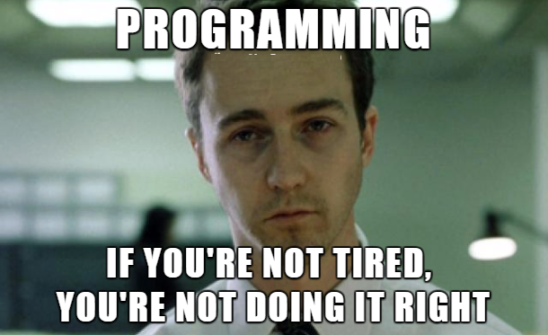

There are many programmer stereotypes roaming around the Internet. But perhaps the most infamous one is the persona of the _Typical programmer_ - a person who spends their entire day locked in a dark room, hunching over the keyboard, staring at the screen through their glasses, and manically typing long lines of code. This individual doesn't go out, doesn't exercise, skips their meals, lives on energy drinks or coffee, and sticks to the mantra "Sleep is for the weak"- due to the busy lifestyle and increased productivity during late hours, _The typical programmer_ cannot afford more than 4 or 5 hours of sleep daily.

Humorous perhaps, the stereotype inspired many memes, T-shirt designs, and quotes.

Programmers mostly laugh at the stereotype, often even embracing it as part of our
culture. Most people, be it programmers or non-programmers, agree that the _Typical
programmer_ is a little exaggerated for the dramatic effect. However, it still poses
a certain psychological danger. It is not so difficult to fall victim to the behavior
in which programmers justify their bad habits by uttering the words "It's normal,
because I'm a programmer", which refers to the _Typical programmer_. I used to be
guilty of this too, and it was not a pleasant experience.

I started studying computer science in 2015. Soon I was getting quite busy with learning and assignments, which eventually caused me to start neglecting habits that I used to do. I stopped exercising because I was just too busy studying. Due to stress, I started eating less regularly and often ate unhealthy fast food, which caused me to gain weight. I started sleeping less.

With time, all these habit changes did not go unnoticed. I was fully aware that I was living a vastly different lifestyle than I used to, but I brushed it off by saying to myself: "I'm becoming a programmer. That's what is supposed to be happening.". Funny memes and quotes, referring to the _Typical programmer_, sprung up in my mind. I smiled and continued.

Other people started noticing changes too, especially my parents. Interestingly, when they told me that they noticed I had given up exercising and was going to sleep late, they didn't even ask me why that was, they just said: "Busy programmer, huh?".

I eventually started working while studying, which made my habits even worse.

At some point, I finally snapped out of it and did some self-reflection. I knew I was not leading the best lifestyle - it had been at the back of my mind for years at that point. But why was I so unhealthy, stressed, and disorganized? Because I am a programmer, right? It's normal, right?

No. It was time to be honest with myself. I was using the "I'm a programmer" excuse to justify bad habits.

Here's what I kept telling myself:

> _I have tons of school assignments, exams, and a lot of pressure at work. I don't have time to eat healthy regular meals. I don't have time to exercise. I don't have the energy to keep a good posture while sitting. I cannot go to sleep early. Sleep is for the weak and I am super productive at night._

Sounds good. But it was all a lie.

Here's the real picture. I procrastinated my schoolwork by binge-watching pointless Youtube videos and scrolling social media. If I had a week to complete a particular assignment, I'd spend the first 6 days procrastinating and going to sleep late, and then pulling a stressful all-nighter on the last day to get the assignment done in time. I would get caught up in this spiral over and over again, causing me to lose confidence in my abilities, which in turn led to even more stress. This led to bad eating habits and low energy. And the cycle repeated.

I had time to sleep. I had time to exercise. I had the option to sit up straight on my chair and eat balanced meals. But it was easier to say "I'm a programmer". It was easier to use the _Typical programmer_ as a role model to justify my bad habits.

At that point, I started experiencing negative health consequences as a result of my bad habits, too. Back pain, vertigo, trouble with breathing, and digestion problems were becoming normality. My mental health had also deteriorated: low self-esteem, trouble focusing and concentrating, decreased productivity, constant fatigue, and distrust in my abilities as a programmer.

This is when I made another important realization: _healthy body, healthy mind. Unhealthy body, unhealthy mind_. Being unhealthy not only caused my body damage, but also took a big toll on my productivity and self-esteem as a programmer, causing slow deliveries and general unhappiness. I realized that in the long term it was not possible to function as a competent programmer if I wouldn't take care of my health.

This is when I took action. I attacked my social media addictions with all my power, and after a hard-fought battle and many falls along the way, I managed to beat them. I set up a personal management system to stay organized and reduce stress. I started going to sleep early and waking up at 5 AM. I started exercising again. I started practicing good posture. I started eating healthier food.

It's easier than it sounds. It's a big misconception that leading an organized, healthy lifestyle requires a lot of willpower and dedication. When done right, it is a fun and rewarding experience that improves the quality of life and health, reduces stress, and enhances mental well-being. This in itself is a great motivation to keep going. A healthy lifestyle also translates well to professional productivity. When done wrong, however, especially if you overdo it, it can be hard to maintain long-term. My good habits did not spring up overnight. I adjusted them to fit my needs and preferences, which is an ongoing process.

It's important to point out - a healthy lifestyle doesn't mean exercising 2 hours per day, 7 days a week. It doesn't mean you can never have pizza again. It's all about moderation. And just like there are many ways in programming to implement something, so are there many ways to implement a healthy lifestyle. You get to choose your version of what it means to be healthy.

--

There are still times when I need to transform into the _Typical programmer_ and bang out an all-nighter or survive on fast food. But it's usually a consequence of an external event that I cannot control or just a bad day. Most of the time I try to live as a healthy programmer because long-term that makes me more productive and keeps my well-being and motivation high.

In conclusion, I'd suggest my fellow programmers not to use the _Typical programmer_ as their role model, no matter how funny it sounds and how easy it is to follow. It might work short-term, but in the long run, it can turn out as the worst experience of your life, physically and mentally.

Once I became honest with myself, I managed to translate "I'm a programmer, I'm supposed to be tired" into "I'm addicted to social media and wasting time. I need to stop lying to myself." and changed my life for the better. My routine is not perfect and I still fail many times, but it keeps me on the right track. Just being honest with myself was the most important step that I had to take.

There were a couple of things in this post that I alluded to, but haven't explained in-depth: How did I beat my addictions? How did I get organized and stress-free? How did I find time to do my hobbies? How did I find the willpower to eat healthily and exercise? These are all huge topics, but in essence, they are all very simple. I'll be detailing them in my upcoming posts, so stay tuned...

Meme image source: [Twitter](https://twitter.com/sekolahkoding/status/681242501693464576?lang=cs)
