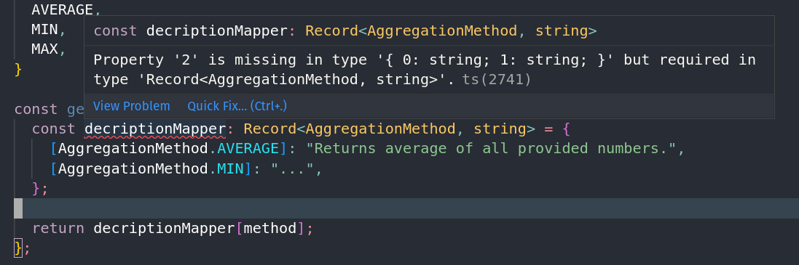

Let's consider the following code:

```ts
// AggregationMethod.ts
export enum AggregationMethod {
  AVERAGE,
  MIN,
  MAX,
}

// computation.ts
const aggregate = (values: number[], method: AggregationMethod): number => {
  if (method === AggregationMethod.AVERAGE) {
    return average(values);
  }

  if (method === AggregationMethod.MIN) {
    return min(values);
  }

  if (method === AggregationMethod.MAX) {
    return max(values);
  }
};
```

The code is clear and readable _for now_, but in the future, we might run into one of the following issues:

- **Adding new enum values** - when adding new values into the `AggregationMethod` enum, we will have to remember to update all usages of the enum. In the example above, this means another if clause. With time this chain will become long, or we might forget to update it.
- **Scattered code** - over time the enum will be used across many files in the codebase. This will cause logically related code to become physically scattered, which will make it harder to reason about the `AggregationMethod` enum.

Consider another function, somewhere else in the codebase (most likely in one of the UI components):

```ts
// help.ts
const getDescription = (method: AggregationMethod): string => {
  if (method === AggregationMethod.AVERAGE) {
    return "Returns average of all provided numbers.";
  } else if (method === AggregationMethod.MIN) {
    // ...
  } else if (method === AggregationMethod.MAX) {
    // ...
  }
};
```

And then, somewhere else:

```ts
// selectAggregationMethod.ts
const aggregationMethod = selectedAggregationMethod ?? AggregationMethod.AVERAGE;
```

Based on the code that we have seen so far, we can make the following conclusions about the `AggregationMethod` enum:

- Each aggregation method has its own way to compute a single number out of an array of numbers.
- Each method has a text description.
- The default method for aggregation is `AggregationMethod.AVERAGE`.

In practice, however, such visibility will be hard to see unless we dig into each of the files that contain chunks of code that relate to `AggregationMethod`. This is the risk of enums.

How can we solve this?

### Do we even need enums?

Before we try to solve this issue, we must ask ourselves if enums are even appropriate for our use case. We could alternatively use polymorphic classes to get rid of conditionals.

In our example, we could create an abstract class `AggregationMethod` with the property `description` and abstract method `aggregate(values: number[])`. We could then create one subclass for each of the concrete aggregation methods and implement `description` and `aggregate`.

This approach makes the code for aggregation methods stick together in the codebase and eliminates risks associated with adding a new method. Adding a new aggregation method becomes as simple as adding a new subclass.

This approach solves our issues, but in front-end applications, we often still need to deal with raw primitive enum-like values. For instance, the user of our application will most likely choose the aggregation method using the dropdown component in the GUI. The value of that dropdown will be a single primitive value, like a string or a number. This is very reminiscent of enums.

In addition, JavaScript front-end applications are often structured in a way that makes it very inconvenient to be passing objects around. Enums often enable a better developer experience.

With that in mind, let's look at an alternative approach.

### Getting rid of if statements

Here's a useful approach that I used a lot in the past - getting rid of if statements using a mapper object. Let's see the refactored `getDescription` function:

```ts
// help.ts
const getDescription = (method: AggregationMethod): string => {
  const descriptionMapper: Record<AggregationMethod, string> = {
    [AggregationMethod.AVERAGE]: "Returns average of all provided numbers.",
    [AggregationMethod.MIN]: "...",
    [AggregationMethod.MAX]: "...",
  };

  return descriptionMapper[method];
};
```

Here we leverage the power of the JavaScript bracket notation for dynamic property access to pick out the right description from the mapper object.

In addition, the mapper object has an explicit type of `Record<AggregationMethod, string>`, which means we are declaring an object with keys of type `AggregationMethod` and values of type `string`. This forces us to specify all enum values in the keys of the object; otherwise Typescript will refuse to compile:



This makes sure that we will never forget to add a new value into the mapper whenever we create a new enum value.

The above approach works for Typescript types as well.

What about `aggregate`? This pattern works for functions too:

```ts
// computation.ts
const aggregate = (values: number[], method: AggregationMethod): number => {
  const aggregationMapper: Record<AggregationMethod, (values: number[]) => number> = {
    [AggregationMethod.AVERAGE]: average,
    [AggregationMethod.MIN]: min,
    [AggregationMethod.MAX]: max,
  };

  const methodFunction = aggregationMapper[method];
  return methodFunction(values);
};
```

We are assuming that `average`, `min` and `max` are functions, defined in the current scope.

Since functions can be passed around as values in JavaScript, we can store them in our mapper object just as we can store other values. Once again we enforce type safety by typing our mapper as `Record<AggregationMethod, (values: number[]) => number>`.

The last two lines of the function could be a one-liner, but we separate it into two lines for better readability.

Note: be vary of `this` binding when using functions this way. You might have to wrap functions in another function to preserve the correct `this` binding.

### Bringing the code to one place

The approach above works well to make sure we never forget to add a new enum value to each of the functions, but it still suffers from the problem of code separation. Preferably, all code for each of the aggregation functions would be in a single file, so we could quickly inspect how each of the aggregations behaves. Here's the pattern I use for this:

```ts
// import statements are omitted
// AggregationMethod.ts
export enum AggregationMethod {
  AVERAGE,
  MIN,
  MAX,
}

// serves as an "abstract class" that aggregation methods must implement
export interface IAggregationMethod {
  description: string;
  aggregate(values: number[]): number;
}

/*
We are able to add additional functions and values to the `AggregationMethod` enum by creating a 
namespace with the same name. Both identifiers should be exported.
*/

export namespace AggregationMethod {
  const AggregationMethodMapper: Record<AggregationMethod, IAggregationMethod> = {
    [AggregationMethod.AVERAGE]: AverageAggregationMethod,
    [AggregationMethod.MIN]: MinAggregationMethod,
    [AggregationMethod.MAX]: MaxAggregationMethod,
  };

  export function get(aggregationMethod: AggregationMethod): IAggregationMethod {
    return AggregationMethodMapper[aggregationMethod];
  }

  export const Default = AggregationMethod.AVERAGE;
}

// AverageAggregationMethod.ts

const AverageAggregationMethod: IAggregationMethod = {
  description: "Returns average of all provided numbers.",
  aggregate(values: number[]): number {
    // ...
  },
};

// MaxAggregationMethod.ts and MinAggregationMethod.ts follow a similar implementation
```

We can then use the method outside like so:

```ts
// get max
AggregationMethod.get(AggregationMethod.MAX).aggregate([1, 2, 3]);

// get default
const aggregationMethod = selectedAggregationMethod ?? AggregationMethod.Default;
```

The `AggregationMethod` identifier becomes the way for the enum to interact with the outside world. We can obtain all the enum values, `get` the enum object and obtain any other properties we need (like `Default`). The code is nicely laid out so that each method has its own file and we can get a quick and easy overview of how the `AggregationMethod` enum behaves.

In addition, the code guides us when creating a new enum value as such:

1. We add a new value to the `AggregationMethod` enum. This triggers an error in `AggregationMethodMapper`.
2. We add a new file for the aggregation method and implement the `IAggregationMethod` interface.
3. We import the newly created object into the main file and add it to the `AggregationMethodMapper`.

Notice how the process above doesn't involve any of the other aggregation methods (average, min or max). The code is cleanly separated but still sticks together as a logical whole.

The type-safe mapper ensures that we always implement aggregation methods in the right way, using the `IAggregationMethod` interface - otherwise, the code doesn't compile.

If we want to add a new function or property to the aggregation method, we must add it to the `IAggregationMethod` interface. This triggers an error in all files, associated with currently implemented aggregation methods, so we have to implement the new function or property for all of them. TypeScript prevents us from leaving the code in an incomplete state.

# Conclusion

Enums can be a really useful tool, as long as we manage to contain them to prevent future maintainability issues. In this blog post, I presented my way of managing TypeScript enums, which helps me keep my enums readable and manageable as the codebase expands.
